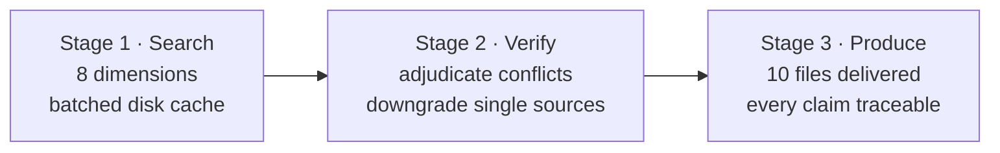

<div align="center">

[中文](README.md) · [English](README.en.md)

# CHAR//FORGE

**Forge any character into a shoot-ready AI persona card**

Search · Verify · Adjudicate · 10 files delivered

[](LICENSE)
[](https://github.com/LaoBiDeng321)
[](#two-builders)
[](#character-cards)
[](https://lbd-charforge.netlify.app/)

</div>

---

**Contents** · [What is this](#what-is-this) · [Workflow](#workflow) · [Two builders](#two-builders) · [The 10-file system](#the-10-file-system) · [Character cards](#character-cards) · [Quick start](#quick-start) · [Self-hosting the showcase site](#self-hosting-the-showcase-site) · [FAQ](#faq) · [Disclaimer](#disclaimer) · [Credits](#credits)

---

## What is this

An Agent Skill system for producing roleplay settings, in three layers:

| Layer | Location | What it is |
|---|---|---|
| Builders | `skills/` | Install into a Skill-capable agent; generates the 10 setting files for any character through a 3-stage pipeline |
| Characters | `char/` | Finished, verified character cards produced by the builders — ready to use for AI roleplay |
| Showcase / downloads | repo root | Site entry is the root `index.html`; builder and character assets live directly in `skills/` and `char/`, with no duplicate copy under `web/` |

> [!NOTE]
> Everything produced here is **official characterisation only** (main story / art books / official profiles / website announcements). Stage 1 actively excludes fan-made sources; a claim backed by a single source never enters the verified canon, and every conflict is written to that character's `conflicts.md`.

## Workflow



> [!TIP]
> Why batch it? Some agents cap a single response, and writing everything at once tends to get truncated. Batched delivery lets you review and adjust between batches. It is also why the builder treats "verify and adjudicate" as its own stage — settle the contradictions first, then write.

## Two builders

| Builder | Use it for | Entry |
|---|---|---|
| [character-profile-builder](skills/character-profile-builder/SKILL.md) | Building official characterisation for **characters from existing works** (games / anime / novels) | SKILL.md |
| [original-character-builder](skills/original-character-builder/SKILL.md) | Building **your own original character** (OC) | SKILL.md |

Both builders share the same 10-file framework (defined in [reference/templates.md](skills/character-profile-builder/reference/templates.md)). They differ only in where material comes from: the first anchors on official text, the second on your own setting documents.

## The 10-file system

| File | Job (in one line) |
|---|---|
| `prompt.md` | Identity core — "who I am", loaded first |
| `world.md` | The world through the character's eyes — the layer that shapes their words and behaviour |
| `profile.md` | Hard-facts lookup table — for when a specific data point is asked |
| `memory.md` | Memory and knowledge boundary — "the self I remember" |
| `personality.md` | Personality anchors and negative calibration — the core of staying in character |
| `behavior.md` | Decision engine — how they think and act when things happen |
| `relations.md` | Relationship map — positions and opinions, with "me" at the centre |
| `interaction.md` | Speech corpus — "what I sound like when I talk" |
| `conflicts.md` | Correction manual — common misreadings vs official facts |
| `SKILL.md` | That character's run rules (load order, self-correction) — not setting content |

> [!IMPORTANT]
> `char/<character>/assets/` holds official key art (not counted among the 10 files). It lets **multimodal models** load the character's appearance at startup — a missing directory is skipped silently and does not affect text-only models.

> [!NOTE]
> **Directory naming convention**: `char/<character>-<work-in-english>` (e.g. `cyrene-honkai-star-rail`, `shu-arknights`). The slug ends up in download paths and ZIP names, so it stays ASCII lowercase with hyphens; including the work avoids collisions between same-named characters from different works.
> **Provenance caches are not committed**: build-time material caches and adjudication records live in `_溯源/<slug>/` at the repo root, a local working directory listed in `.gitignore`. A clone of this repo does not contain it; if you want to derive a fan version, collect the material yourself or ask the author.

## Character cards

| Character | Directory | Source | Setting files |
|---|---|---|---|
| White Rice Fish | [char/white-rice-fish-deepseek](char/white-rice-fish-deepseek/prompt.md) | DeepSeek Community | 10 |
| Shu | [char/shu-arknights](char/shu-arknights/prompt.md) | Arknights | 10 |
| Citlali | [char/citlali-genshin-impact](char/citlali-genshin-impact/prompt.md) | Genshin Impact | 10 |
| Priestess | [char/priestess-arknights](char/priestess-arknights/prompt.md) | Arknights | 10 |
| Alf | [char/alf-silver-palace](char/alf-silver-palace/prompt.md) | Silver Palace | 10 |
| Cyrene | [char/cyrene-honkai-star-rail](char/cyrene-honkai-star-rail/prompt.md) | Honkai: Star Rail | 10 (three-form tiers) |
| Perlica | [char/perlica-arknights-endfield](char/perlica-arknights-endfield/prompt.md) | Arknights: Endfield | 10 |
| March 7th (incl. Evernight) | [char/march-7th-honkai-star-rail](char/march-7th-honkai-star-rail/prompt.md) | Honkai: Star Rail | 10 (three forms) |

A character's full roleplay entry point is its `SKILL.md` (run rules) plus `prompt.md` (personality snapshot).

> [!NOTE]
> Card thumbnails go in `thumbnails/<slug>/cover.*` (square image preferred). `build_data.py` writes them into the `thumbnail` field of `index.json`, and the front end shows them on the left of each card.

> [!IMPORTANT]
> **Adding a character = two same-named directories plus one file. No code changes.**
>
> ```text
> char/<slug>/          <- delivery directory (10 setting files + assets/, kept clean)
> meta/<slug>.json      <- display metadata (a JSON with the same name)
> thumbnails/<slug>/    <- square thumbnail (optional)
> ```
>
> `build_data.py` simply **scans the directory** (`meta/*.json`). The slug comes from the filename and the delivery directory is derived as `char/<slug>` — neither has to be repeated in the JSON.
>
> Why split it into one file per character: previously every character sat in a single `CHARS` table inside `build_data.py`, so **adding one meant editing the same shared file** — as the roster grows, both the context cost of "read the file before you can add anyone" and the merge conflicts grow linearly. After the split, adding a character means looking at exactly one new file.
>
> `meta/<slug>.json` only needs display fields:
>
> | Field | Purpose |
> |---|---|
> | `name` / `alias` / `nameEn` | Primary name, English alias, English name |
> | `company` | Level 1 of the locator index (company), with `id` / `zh-CN` / `en-US` |
> | `work` | Level 2 of the locator index (work), same shape as `company`. **Omitting it means "single level"** — no second row appears under that company |
> | `origin` / `tags` | Source and tags, with `zh-CN` / `en-US` |
> | `reading` | **Only for heteronyms**, see below |
>
> `pinyin` / `pinyinInitials` and the Chinese sort key are all **derived automatically at build time** (`pypinyin`, MIT), covering Chinese and English names plus work and company names, with **no manual maintenance** — one round of hand-filling produced `puruisaishi` for 普瑞赛斯, when the correct reading is `puruisaisi`.
>
> **The only exception is a heteronym the library reads wrong**, in which case add `reading` as **space-separated per-character readings**:
>
> ```json
> { "name": "茜特菈莉", "reading": "xi te la li" }
> ```
>
> pypinyin defaults to reading 茜 as *qiàn*. The syllable count must equal the number of Chinese characters or the build fails outright. There is exactly one such case in the whole repo; **every other character needs no `reading`.**
>
> ⚠️ `meta/` sits alongside `char/`, outside the delivery directory — deliberately: `char/<slug>/` must stay clean (only the 10 setting files plus `assets/`), and metadata placed inside it would be picked up by `collect_files()` and end up in the ZIPs and in the site data.

> [!TIP]
> **The character index searches across: Chinese / full pinyin / initials / English / fragments / traditional characters / typos.** Both the Chinese and English UI can find the other language. It works in three passes:
>
> | Pass | Covers | Examples |
> |---|---|---|
> | 1 · exact · prefix · **fragment** · tokenised | Chinese name, English name, full pinyin and initials, work, company, origin, tags. Chinese matches as an **any-length substring**, so typing only the tail works | `佩丽卡` `peilika` `plk` `perlica` `ys` `方舟` `starrail` `肥鱼` `丽卡` `特菈莉` `终末地` |
> | 2 · normalisation retries (**into the result list**) | **a. separator stripping** for spaced or hyphenated pinyin; **b. syllable-level reordering** — segment against this entry's syllable list in any order, which handles "I remembered the syllables but got the order wrong" | a: `pei li ka` `pei-li-ka`<br>b: `dayufei` `yufei` `peika` `lali` |
> | 3 · fallback candidates (**only ever offered as "did you mean", never mixed into the result list**) | **Damerau-Levenshtein** for typos / dropped / transposed / homophone / traditional characters; when that yields nothing, **subsequence** matching for skipped-character abbreviations and initial tails (**≤3 characters only**) | DL: `pelica` `prelica` `佩莉卡` `佩麗卡` `崩壞：星穹鐵道`<br>Subsequence: `吃肥鱼` `佩卡` `fy` `lk` |
>
> **Why syllable-level beats string distance**: character-level distance is completely blind to syllable transposition — `dayufei` vs `dafeiyu` costs 4 steps at the character level, but at the syllable level it is just da / fei / yu in a different order. The syllable list is generated at build time by pypinyin, character by character (the heteronym `reading` override applies here too), so the front end needs no syllable dictionary of its own; a match requires the query to be **segmented completely, using only syllables from that entry**, which is a precise constraint — hence it can feed the result list without false hits.
>
> **Thresholds and safety rails**: DL adapts to query length (none at ≤2 chars / distance 1 at 3–5 / distance 2 at ≥6); **subsequence matching is open only to queries of ≤3 characters** (the longer the query, the likelier it is to be "accidentally a subsequence" of something, so long words on that path amount to pulling results at random); both fallbacks fire only when passes 1 and 2 return nothing. So `zzz` matches nothing, and `ys` is never swallowed by an initial string like `lys`.
> Matches always keep the display order; there is no relevance re-ranking.
>
> **Known boundary**: the "**out-of-order skip**" that neither substring nor subsequence covers — `大白鱼` (大…**白**…鱼 — 白 comes before 大) does not match, while `吃肥鱼` and `大肥鱼` do. Short substrings are relaxed to ≥2 characters on full-pinyin fields (`yu` → White Rice Fish), but **not on initial strings**, otherwise `ys` would be wrongly matched by `lys`.

## Quick start

```bash
# Get the repo
git clone https://github.com/LaoBiDeng321/charforge.git
cd charforge

# Preview the showcase site locally (a static server only — no dependencies to install;
# the site has been flattened to the repo root)
python -m http.server 8765
# Open http://localhost:8765
```

<details>
<summary><strong>Updating site content and the download packages (after adding a character / editing a skill / changing images)</strong></summary>

```bash
# Run from the repo root
pip install -r requirements.txt   # build dependency: pypinyin (Chinese to pinyin, MIT)
python build_data.py
```

It generates:

- `index.json` — the resource index shared by the site and by agents (metadata, file manifest, sha256, download URLs, card thumbnails, locator index and pinyin search keys);
- `downloads/skills/<slug>.zip`, `downloads/char/<slug>.zip` — static ZIPs containing the Markdown and the `assets/` images;
- square images under `thumbnails/<slug>/` are written into the `thumbnail` field of `index.json`;
- the `?v=` content hashes on the `js/` and `css/` references in `index.html`, plus its **two version numbers** (boot screen and footer) — the version is stamped as `VER YY.MM.DD` using the build date.

> [!NOTE]
> **The version number needs no manual maintenance.** It is date-based, and the build day *is* the release day, so `build_data.py` stamps it directly; forgetting it can no longer leave it stranded on an old date (which is exactly how it had been stuck on `26.09.14`).
> You can still set it by hand — edit `VER xx.xx.xx` in `index.html` to whatever you want, **then** run the build. The script only rewrites it when the date differs, and rebuilding on the same day is byte-identical.

At runtime the front end does `fetch('index.json')` and no longer uses an inlined `data.js`. `downloads/` is a build artefact and is excluded via `.gitignore`; Netlify generates it during its build, so run the script once before previewing locally.

</details>

<details>
<summary><strong>Installing a builder into your agent</strong></summary>

1. Copy the whole `skills/<builder>/` directory into your agent's skills directory (the path convention differs per host — `.claude/skills/` for Claude Code, `.trae/skills/` for Trae)
2. Or download `downloads/skills/<builder>.zip` and unzip it into the skills directory (full packages live in `downloads/`, generated by `build_data.py`)
3. Or click "copy for agent install" on a web builder / character card and paste the prompt to your agent, letting it download and install from `index.json`
4. Or paste the builder's SKILL.md content straight into the conversation
5. Then make a request, e.g. "build a roleplay profile for Shu from Arknights"

</details>

## Self-hosting the showcase site

> [!IMPORTANT]
> The showcase site is deployed at **[lbd-charforge.netlify.app](https://lbd-charforge.netlify.app/)**. The site has been flattened to the repo root, Netlify's publish root is `.`, and the root [index.html](index.html) is the site entry. Files under `skills/`, `char/` and the ZIPs under `downloads/` are all directly reachable from the site.

Forking and want your own domain or an independent deployment? The whole repo root is a pure static site (no framework, no server) and will run on any static host (Vercel / Netlify / object storage). Netlify runs `python3 build_data.py` at build time to generate `index.json` and `downloads/`.

> [!WARNING]
> `index.json` and `downloads/*.zip` are both generated by `build_data.py`. Netlify builds automatically; on a host without a build step, such as GitHub Pages, run `python build_data.py` locally before committing and commit at least `index.json` plus the ZIPs you need — or switch to GitHub Actions.

## FAQ

<details>
<summary>Can I run the builders with a web-based AI product (a browser chat UI)?</summary>

Yes, but web UIs usually limit how many and how long searches can be, so overall search quality falls short of a full agent. The builder's three stages depend heavily on search quality, so a tool that supports skill loading is recommended.

</details>

<details>
<summary>Can the same `world.md` be reused for characters in the same setting?</summary>

No. `world.md` is "the worldview through that character's eyes" — a world layer filtered by that character's experiences, not an objective setting document. Each character under a given work has their own.

</details>

<details>
<summary>Can the produced files be forwarded directly?</summary>

The builders and the site code are MIT-licensed. Copyright in the character material belongs to the respective rights holders — please credit the source, and use it for community roleplay and learning only.

</details>

<details>
<summary>Why does the site show a desktop layout on my phone? Does focusing the search box zoom the page?</summary>

The site is desktop-first, so phones default to **PC view** (viewport pinned to `width=1280` and scaled to fit); without `localStorage` (private mode, etc.) the choice is decided from the UA on the spot. To switch back to responsive, use the display-mode toggle in the footer or open `?view=auto` (force PC with `?view=pc`).

The search-box focus zoom is handled: in PC view the page is scaled to ~0.3×, so focusing an input inside the shrunken panel would make the browser zoom in, which used to combine badly with the full-page scroll. On touch devices the search panel now **fills the screen and undoes the page scaling**, so no font inflation is needed and focus no longer zooms. See [WEB.md → 手机端与 PC 视图](WEB.md#手机端与-pc-视图) (Chinese).

</details>

## Disclaimer

**Setting material**: the content of the eight character cards is drawn from each work's official text (main story / art books / official announcements), and copyright belongs to the respective rights holders. This repo only organises it, labels it and keeps it traceable — it claims no rights over the material.

**Images**: card key art comes from official channels, though **a few were supplied manually by a user with the original retrieval link unrecorded** (noted in each character's `assets/README.md`); the **character thumbnails under `thumbnails/` were collected from community sources**, and for several of them **the original author could not be identified** while preparing this repo.

If you are the author of one of those images:

- **Credit** — open an issue with a link to your work, and the source and your name will be added;
- **Removal** — open an issue and it will be taken down as soon as it is seen, **no reason required**.

**This is a gap in my record-keeping, not an absence of provenance.** The current state of each image is listed in [`thumbnails/README.md`](thumbnails/README.md).

**Generated content**: AI roleplay output does not represent any official stance of the original works, and users bear full responsibility for anything produced with it.

**Intended use**: all resources are for learning, research and personal entertainment only — reselling or commercial use is prohibited.

## Credits

> "If I have seen further it is by standing on the shoulders of Giants."
>
> — Isaac Newton to Robert Hooke, 5 February 1676

The visual language comes from Endfield-Style-Skill, the interface taste references taste-skill, the fuzzy matching algorithm is talisman's, and Chinese romanisation is delegated to pypinyin. **The noise-control strategy for search (capping the subsequence fallback) and the idea of comparing pinyin at the syllable level instead of by string distance both came from 小肥鱼（幼鲸）.** As for the eight character cards — every one of them stands on the shoulders of its **source work**, and on the shoulders of everyone who transcribed the official text line by line so that later readers could check it.

All I did was stack them carefully, and make sure every claim in the stack can be traced back to where it came from. **Break the provenance and none of this is worth anything** — so if you spot a setting that looks wrong, bring the source and open an issue.

| Used for | Standing on the shoulders of |
|---|---|
| Visual language | [Endfield-Style-Skill](https://github.com/LaoBiDeng321/Endfield-Style-Skill) |
| Interface taste | [taste-skill](https://github.com/Leonxlnx/taste-skill) |
| Fuzzy matching | [talisman](https://github.com/yomguithereal/talisman) (`metrics/damerau-levenshtein.js`, MIT, a 5.5 KB single file vendored into `js/vendor/`, algorithm unmodified) |
| Chinese romanisation | [pypinyin](https://github.com/mozillazg/python-pinyin) (MIT, build-time only, not shipped to the runtime) |
| Search design | **小肥鱼（幼鲸）** — pointed out that the subsequence fallback should stop taking long words (cap at ≤3 characters), and that pinyin should be segmented into syllables and compared at that level rather than run through string distance |
| Character settings | The respective rights holders and the people who transcribed the material; copyright remains with them |
| Maintainer | [LaoBiDeng321](https://github.com/LaoBiDeng321) (solo maintainer) |

---

<div align="center">

**CHAR//FORGE** — Search · Verify · Adjudicate · 10 files delivered

[](https://lbd-charforge.netlify.app/)

</div>
