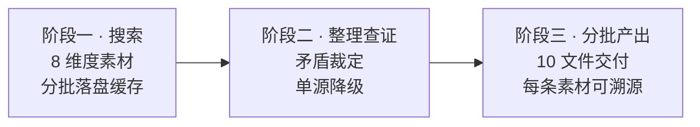

<div align="center">

# CHAR//FORGE

**把任意角色锻造成可直接开拍的 AI 人设卡**

搜索溯源 · 查证裁定 · 10 文件交付

[](LICENSE)
[](https://github.com/LaoBiDeng321)
[](#-两个构建器)
[](#-角色一览)
[](https://lbd-charforge.netlify.app/)

</div>

---

**目录** · [这是什么](#这是什么) · [工作流程](#工作流程) · [两个构建器](#两个构建器) · [10 文件体系](#10-文件体系) · [角色一览](#角色一览) · [快速开始](#快速开始) · [自部署展示站](#自部署展示站) · [FAQ](#faq) · [署名](#署名)

---

## 这是什么

一套「产出角色扮演设定」的 Agent Skill 体系，三层结构：

| 层 | 位置 | 说明 |
|---|---|---|
| 构建器 | `skills/` | 装入支持 Skill 的 agent，按三阶段为任意角色生成 10 份扮演设定文件 |
| 角色 | `char/` | 用构建器产出并核定的成品角色卡，可直接用于 AI 扮演 |
| 展示/下载 | 仓库根 | 站点入口为根目录 `index.html`；构建器与角色资源直接位于 `skills/`、`char/`，无需在 `web/` 再复制一份 |

> [!NOTE]
> 产出的一律是**官方人设**（正剧 / 设定集 / 公式书 / 官网公告），阶段一主动排除二创来源；单源孤证不入核定设定，矛盾点全部落盘到角色的 `conflicts.md`。

## 工作流程



> [!TIP]
> 为什么分批？部分 agent 有单次输出上限，一次写完容易被截断；分批交付让你在每批之间审查调整。这也是构建器把「整理查证」设为独立阶段的原因——先把矛盾裁掉，再动笔。

## 两个构建器

| 构建器 | 适用场景 | 入口 |
|---|---|---|
| [character-profile-builder](skills/character-profile-builder/SKILL.md) | 为**既有作品中的角色**（游戏 / 动漫 / 小说）构建官方人设 | SKILL.md |
| [original-character-builder](skills/original-character-builder/SKILL.md) | 构建**你的原创角色**（OC） | SKILL.md |

两个构建器共享同一套 10 文件框架（定义见 [reference/templates.md](skills/character-profile-builder/reference/templates.md)），差异只在素材来源：前者以官方语料为锚，后者以你的设定稿为锚。

## 10 文件体系

| 文件 | 职责（一句话） |
|---|---|
| `prompt.md` | 自我认同内核——"我是谁"，第一优先加载 |
| `world.md` | 角色眼中的世界——塑造其言语与行为的世界层 |
| `profile.md` | 硬事实查询表——被问到具体数据时快速取用 |
| `memory.md` | 记忆库与知识边界——"我记得的自己" |
| `personality.md` | 性格锚点与反面校准——防 OOC 的核心 |
| `behavior.md` | 决策引擎——遇事怎么想、怎么做 |
| `relations.md` | 社会关系图——以"我"为圆心的关系定位与评价 |
| `interaction.md` | 语言素材库——"我说的话听起来应该是什么样" |
| `conflicts.md` | 纠偏手册——误读说法 vs 官方事实 |
| `SKILL.md` | 该角色的运行规则（加载顺序与自纠），非设定内容 |

> [!IMPORTANT]
> `char/<角色>/assets/` 存放官方立绘（不计入 10 文件），供**多模态模型**在扮演启动时加载外貌认知——目录缺失时静默跳过，不影响纯文本模型。

> [!NOTE]
> **目录命名约定**：`char/<角色名>-<作品英文名>`（例：`cyrene-honkai-star-rail`、`shu-arknights`）。slug 会进下载路径与 ZIP 名，故统一用 ASCII 小写连字符；带上作品名可避免不同作品里的同名角色冲突。
> **溯源缓存不入库**：构建期的素材缓存与裁定记录存放在仓库根的 `_溯源/<slug>/`，属本地工作目录（已列入 `.gitignore`），克隆本仓库不含该目录；如需做二创派生版本，请自行重新采集或向作者索取。

## 角色一览

| 角色 | 目录 | 来源 | 设定文件 |
|---|---|---|---|
| 吃白饭的大肥鱼 | [char/white-rice-fish-deepseek](char/white-rice-fish-deepseek/prompt.md) | DeepSeek 社区拟人 | 10 |
| 黍 | [char/shu-arknights](char/shu-arknights/prompt.md) | 明日方舟 | 10 |
| 茜特菈莉 | [char/citlali-genshin-impact](char/citlali-genshin-impact/prompt.md) | 原神 | 10 |
| Priestess | [char/priestess-arknights](char/priestess-arknights/prompt.md) | 明日方舟 | 10 |
| Alf | [char/alf-silver-palace](char/alf-silver-palace/prompt.md) | 白银之城 | 10 |
| 昔涟 | [char/cyrene-honkai-star-rail](char/cyrene-honkai-star-rail/prompt.md) | 崩坏：星穹铁道 | 10（三阶段档位） |

每个角色的完整扮演入口是其目录下的 `SKILL.md`（运行规则）+ `prompt.md`（人格快照）。

> [!NOTE]
> 角色卡缩略图放在 `thumbnails/<slug>/cover.*`（推荐方形图）；`build_data.py` 会自动写入 `index.json` 的 `thumbnail` 字段，前端角色卡左侧显示。

## 快速开始

```bash
# 获取仓库
git clone https://github.com/LaoBiDeng321/charforge.git
cd charforge

# 本地预览展示站（无需依赖安装；站点已扁平化到仓库根）
python -m http.server 8765
# 浏览器访问 http://localhost:8765
```

<details>
<summary><strong>更新网站内容与分发包（新增角色 / 修改 skill / 改图片后）</strong></summary>

```bash
# 在仓库根目录运行
python build_data.py
```

脚本只依赖 Python 标准库，无第三方包。它会生成：

- `index.json`：站点与 Agent 共用的资源索引（元数据、文件清单、sha256、下载地址、角色缩略图）；
- `downloads/skills/<slug>.zip`、`downloads/char/<slug>.zip`：包含 Markdown 与 `assets/` 图片的静态 ZIP；
- `thumbnails/<slug>/` 下的方形图会被写入 `index.json` 的 `thumbnail` 字段。

前端运行时 `fetch('index.json')`，不再使用内联 `data.js`。`downloads/` 是构建产物，已在 `.gitignore` 中排除；Netlify 构建会自动生成，本地预览前请先执行一次脚本。

</details>

<details>
<summary><strong>把构建器装进你的 agent</strong></summary>

1. 将 `skills/<构建器>/` 整个目录复制到你的 agent 的技能目录（不同宿主的路径约定不同，如 Claude Code 为 `.claude/skills/`、Trae 为 `.trae/skills/`）
2. 或直接下载 `downloads/skills/<构建器>.zip`，解压到技能目录（完整包见 `downloads/`，由 `build_data.py` 生成）
3. 或在网页构建器 / 角色卡上点「复制至agent安装」，把提示词粘贴给 Agent，让它按 `index.json` 自动下载安装
4. 或直接把构建器的 SKILL.md 内容粘贴进对话
5. 发起请求，例如："为《明日方舟》的黍构建角色扮演设定"

</details>

## 自部署展示站

> [!IMPORTANT]
> 展示站已部署：**[lbd-charforge.netlify.app](https://lbd-charforge.netlify.app/)**。站点已扁平化到仓库根，Netlify 发布根为 `.`，根目录的 [index.html](index.html) 就是站点入口；`skills/`、`char/` 下的文件与 `downloads/` 下的 ZIP 都可以通过站点直接访问。

Fork 后想用自己的域名或独立部署？整个仓库根是纯静态站点（无框架、无服务端），扔进任何静态托管（Vercel / Netlify / 对象存储）都能跑。Netlify 会在构建时执行 `python3 build_data.py` 生成 `index.json` 与 `downloads/`。

> [!WARNING]
> `index.json` 与 `downloads/*.zip` 都由 `build_data.py` 生成。Netlify 会自动构建；如果使用 GitHub Pages 这类无构建步骤的主机，请在提交前本地执行 `python build_data.py`，至少提交 `index.json` 与需要的 ZIP，或改用 GitHub Actions 构建。

## FAQ

<details>
<summary>可以使用 web 端的 AI 产品（网页对话版）跑构建器吗？</summary>

可以，但一般web端会限制搜索的个数或长度，总体搜索能力不如完整的 agent。构建器的三阶段强依赖搜索质量，推荐使用支持技能加载的工具。

</details>

<details>
<summary>同一世界观下，角色的 world.md 可以通用吗？</summary>

不可以。`world.md` 是「角色眼中的世界观」——经过该角色经历过滤的世界层，不是客观世界设定。同一作品下每个角色各有一份。

</details>

<details>
<summary>产出文件可以直接转发吗？</summary>

构建器与网站代码遵循 MIT 协议；角色设定素材的版权归各自原作版权方所有，转载请注明来源，仅用于社区扮演与学习交流。

</details>

## 署名

| | |
|---|---|
| 视觉语言 | [Endfield-Style-Skill（终末地风格 SKILL）](https://github.com/LaoBiDeng321/Endfield-Style-Skill) |
| 界面审美参考 | [taste-skill](https://github.com/Leonxlnx/taste-skill) |
| 维护者 | [LaoBiDeng321](https://github.com/LaoBiDeng321)（个人维护） |

---

<div align="center">

**CHAR//FORGE** — 搜索溯源 · 查证裁定 · 10 文件交付

[](https://lbd-charforge.netlify.app/)

</div>
