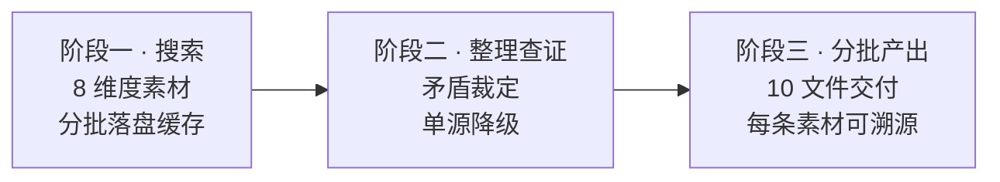

<div align="center">

[中文](README.md) · [English](README.en.md)

# CHAR//FORGE

**把任意角色锻造成可直接开拍的 AI 人设卡**

搜索溯源 · 查证裁定 · 10 文件交付

[](LICENSE)
[](https://github.com/LaoBiDeng321)
[](#两个构建器)
[](#角色一览)
[](https://lbd-charforge.netlify.app/)

</div>

---

**目录** · [这是什么](#这是什么) · [工作流程](#工作流程) · [两个构建器](#两个构建器) · [10 文件体系](#10-文件体系) · [角色一览](#角色一览) · [快速开始](#快速开始) · [自部署展示站](#自部署展示站) · [FAQ](#faq) · [免责声明](#免责声明) · [署名](#署名)

---

## 这是什么

一套「产出角色扮演设定」的 Agent Skill 体系，三层结构：

| 层 | 位置 | 说明 |
|---|---|---|
| 构建器 | `skills/` | 装入支持 Skill 的 agent，按三阶段为任意角色生成 10 份扮演设定文件 |
| 角色 | `char/` | 用构建器产出并核定的成品角色卡，可直接用于 AI 扮演 |
| 展示/下载 | 仓库根 | 站点入口为根目录 `index.html`；构建器与角色资源直接位于 `skills/`、`char/`，无需在 `web/` 再复制一份 |

> [!NOTE]
> 产出的一律是**官方人设**（正剧 / 设定集 / 公式书 / 官网公告），阶段一主动排除二创来源；单源孤证不入核定设定，矛盾点全部落盘到角色的 `conflicts.md`。

## 工作流程



> [!TIP]
> 为什么分批？部分 agent 有单次输出上限，一次写完容易被截断；分批交付让你在每批之间审查调整。这也是构建器把「整理查证」设为独立阶段的原因——先把矛盾裁掉，再动笔。

## 两个构建器

| 构建器 | 适用场景 | 入口 |
|---|---|---|
| [character-profile-builder](skills/character-profile-builder/SKILL.md) | 为**既有作品中的角色**（游戏 / 动漫 / 小说）构建官方人设 | SKILL.md |
| [original-character-builder](skills/original-character-builder/SKILL.md) | 构建**你的原创角色**（OC） | SKILL.md |

两个构建器共享同一套 10 文件框架（定义见 [reference/templates.md](skills/character-profile-builder/reference/templates.md)），差异只在素材来源：前者以官方语料为锚，后者以你的设定稿为锚。

## 10 文件体系

| 文件 | 职责（一句话） |
|---|---|
| `prompt.md` | 自我认同内核——"我是谁"，第一优先加载 |
| `world.md` | 角色眼中的世界——塑造其言语与行为的世界层 |
| `profile.md` | 硬事实查询表——被问到具体数据时快速取用 |
| `memory.md` | 记忆库与知识边界——"我记得的自己" |
| `personality.md` | 性格锚点与反面校准——防 OOC 的核心 |
| `behavior.md` | 决策引擎——遇事怎么想、怎么做 |
| `relations.md` | 社会关系图——以"我"为圆心的关系定位与评价 |
| `interaction.md` | 语言素材库——"我说的话听起来应该是什么样" |
| `conflicts.md` | 纠偏手册——误读说法 vs 官方事实 |
| `SKILL.md` | 该角色的运行规则（加载顺序与自纠），非设定内容 |

> [!IMPORTANT]
> `char/<角色>/assets/` 存放官方立绘（不计入 10 文件），供**多模态模型**在扮演启动时加载外貌认知——目录缺失时静默跳过，不影响纯文本模型。

> [!NOTE]
> **目录命名约定**：`char/<角色名>-<作品英文名>`（例：`cyrene-honkai-star-rail`、`shu-arknights`）。slug 会进下载路径与 ZIP 名，故统一用 ASCII 小写连字符；带上作品名可避免不同作品里的同名角色冲突。
> **溯源缓存不入库**：构建期的素材缓存与裁定记录存放在仓库根的 `_溯源/<slug>/`，属本地工作目录（已列入 `.gitignore`），克隆本仓库不含该目录；如需做二创派生版本，请自行重新采集或向作者索取。

## 角色一览

| 角色 | 目录 | 来源 | 设定文件 |
|---|---|---|---|
| 吃白饭的大肥鱼 | [char/white-rice-fish-deepseek](char/white-rice-fish-deepseek/prompt.md) | DeepSeek 社区拟人 | 10 |
| 黍 | [char/shu-arknights](char/shu-arknights/prompt.md) | 明日方舟 | 10 |
| 茜特菈莉 | [char/citlali-genshin-impact](char/citlali-genshin-impact/prompt.md) | 原神 | 10 |
| 普瑞赛斯 | [char/priestess-arknights](char/priestess-arknights/prompt.md) | 明日方舟 | 10 |
| 阿芙 | [char/alf-silver-palace](char/alf-silver-palace/prompt.md) | 白银之城 | 10 |
| 昔涟 | [char/cyrene-honkai-star-rail](char/cyrene-honkai-star-rail/prompt.md) | 崩坏：星穹铁道 | 10（三阶段档位） |
| 佩丽卡 | [char/perlica-arknights-endfield](char/perlica-arknights-endfield/prompt.md) | 明日方舟：终末地 | 10 |

每个角色的完整扮演入口是其目录下的 `SKILL.md`（运行规则）+ `prompt.md`（人格快照）。

> [!NOTE]
> 角色卡缩略图放在 `thumbnails/<slug>/cover.*`（推荐方形图）；`build_data.py` 会自动写入 `index.json` 的 `thumbnail` 字段，前端角色卡左侧显示。

> [!IMPORTANT]
> **新增角色 = 建两个同名目录 + 一个文件，不用改任何代码：**
>
> ```text
> char/<slug>/          ← 交付目录（10 个设定文件 + assets/，保持纯净）
> meta/<slug>.json      ← 展示元数据（同名的 JSON）
> thumbnails/<slug>/    ← 方形缩略图（可选）
> ```
>
> `build_data.py` 只做**目录扫描**（`meta/*.json`），slug 取文件名、交付目录取 `char/<slug>`，两者都不用在 JSON 里重复写。
>
> 为什么要拆成"一人一文件"：原先所有角色挤在 `build_data.py` 的一个 `CHARS` 大表里，**加一个人就要动同一个文件**——角色一多，光是"读一遍才能加人"的上下文成本和改冲突都会随人数线性上涨。拆开后加角色只需要看那一个新文件。
>
> `meta/<slug>.json` 里只需写展示字段：
>
> | 字段 | 作用 |
> |---|---|
> | `name` / `alias` / `nameEn` | 主名、英文别名、英文名 |
> | `company` | 定位索引一级（公司），含 `id` / `zh-CN` / `en-US` |
> | `work` | 定位索引二级（作品），结构同 `company`。**省略即为"单层"**，该公司下不出现二级栏 |
> | `origin` / `tags` | 来源与标签，含 `zh-CN` / `en-US` |
> | `reading` | **仅多音字需要**，见下 |
>
> `pinyin` / `pinyinInitials` / 中文排序键全部由构建期**自动推导**（`pypinyin`，MIT），中英名 + 作品 + 公司名都覆盖，**不需要人工维护**——人工填过一轮，`普瑞赛斯` 就填成了 `puruisaishi`（正确是 `puruisaisi`）。
>
> **唯一的例外是库判错读音的多音字**，此时加 `reading`，用**空格分隔逐字读音**：
>
> ```json
> { "name": "茜特菈莉", "reading": "xi te la li" }
> ```
>
> pypinyin 默认把「茜」判为 qiàn；音节数必须等于汉字数，否则构建直接报错。全站目前只有这一处，**其余角色一律不用写 `reading`。**
>
> ⚠️ `meta/` 与 `char/` 平级、在交付目录之外——这是刻意的：`char/<slug>/` 必须保持纯净（只有 10 个设定文件 + `assets/`），元数据放进去会被 `collect_files()` 扫进 ZIP 和站点数据。

> [!TIP]
> **角色索引支持：中文 / 全拼 / 首字母 / 英文 / 片段 / 繁简互通 / 拼写容错。** 在中文与英文界面下都能搜到另一种语言。分三段生效：
>
> | 阶段 | 覆盖 | 例 |
> |---|---|---|
> | ① 精确·前缀·**片段**·分词 | 中文名、英文名、拼音全拼与首字母、作品、公司、来源、标签。中文是**任意长度子串**，所以只打后半段也能命中 | `佩丽卡` `peilika` `plk` `perlica` `ys` `方舟` `starrail` `肥鱼` `丽卡` `特菈莉` `终末地` |
> | ② 归一化重试（**进结果列表**） | **a. 去分隔符**：分写 / 带连字符的拼音；**b. 音节级重排**：按本条目的音节表切分，顺序任意——治「音节记错顺序」 | a：`pei li ka` `pei-li-ka`<br>b：`dayufei` `yufei` `peika` `lali` |
> | ③ 兜底候选（**只出「你是不是想找」，不污染结果列表**）| 先 **Damerau-Levenshtein** 抓错字/漏字/换位/同音字/繁体；零候选时再用**子序列**抓跳字缩写与首字母尾片段（**仅限 ≤3 字**） | DL：`pelica` `prelica` `佩莉卡` `佩麗卡` `崩壞：星穹鐵道`<br>子序列：`吃肥鱼` `佩卡` `fy` `lk` |
>
> **为什么音节级比字符串距离好使**：字符级距离对音节换位完全无感——`dayufei` 与 `dafeiyu` 在字符级要 4 步，在音节级只是 da / fei / yu 换了个顺序。音节表由构建期用 pypinyin 逐字切好下发（多音字 `reading` 覆盖同样生效），前端不必自带音节词典；匹配要求**整段切完、且音节都来自本条目**，是精确约束，所以能直接进结果列表而不误伤。
>
> **阈值与安全边界**：DL 按查询长度自适应（≤2 字不放行 / 3–5 字允许距离 1 / ≥6 字允许距离 2）；**子序列只对 ≤3 字开放**（查询越长，「碰巧是某串子序列」的概率越大，长词走这条路基本等于随机捞结果）；两条兜底都只在①②零命中时触发。所以 `zzz` 什么都不命中，`ys` 也不会被 `lys` 这类首字母串吃掉。
> 每次命中都保留展示顺序，不做相关性重排。
>
> **已知边界**：子串 + 子序列覆盖不到的「**逆序跳字**」——`大白鱼`（大…**白**…鱼，白排在大的前面）搜不到，`吃肥鱼`、`大肥鱼` 可以。全拼字段的短子串放宽到 ≥2 位（`yu`→大肥鱼），但**首字母串不放宽**，否则 `ys` 会被 `lys` 误命中。

## 快速开始

```bash
# 获取仓库
git clone https://github.com/LaoBiDeng321/charforge.git
cd charforge

# 本地预览展示站（只起静态服务，不装任何依赖；站点已扁平化到仓库根）
python -m http.server 8765
# 浏览器访问 http://localhost:8765
```

<details>
<summary><strong>更新网站内容与分发包（新增角色 / 修改 skill / 改图片后）</strong></summary>

```bash
# 在仓库根目录运行
pip install -r requirements.txt   # 构建依赖：pypinyin（汉字转拼音，MIT）
python build_data.py
```

它会生成：

- `index.json`：站点与 Agent 共用的资源索引（元数据、文件清单、sha256、下载地址、角色缩略图、定位索引与拼音检索键）；
- `downloads/skills/<slug>.zip`、`downloads/char/<slug>.zip`：包含 Markdown 与 `assets/` 图片的静态 ZIP；
- `thumbnails/<slug>/` 下的方形图会被写入 `index.json` 的 `thumbnail` 字段；
- `index.html` 里 `js/`、`css/` 引用的 `?v=` 内容哈希，以及**两处版本号**（开屏 + 页脚）——版本号按下发版当天日期写成 `VER YY.MM.DD`。

> [!NOTE]
> **版本号不需要手工维护。** 它是日期制的，构建当天就是发版日，`build_data.py` 直接盖戳；忘了改也不会滞留在旧日期（这正是它先前停在 `26.09.14` 的原因）。
> 想手工指定也可以——先把 `index.html` 里的 `VER xx.xx.xx` 改成你要的值，**再**跑构建；脚本只在日期不一致时才改写，同一天重复构建结果完全一致。

前端运行时 `fetch('index.json')`，不再使用内联 `data.js`。`downloads/` 是构建产物，已在 `.gitignore` 中排除；Netlify 构建会自动生成，本地预览前请先执行一次脚本。

</details>

<details>
<summary><strong>把构建器装进你的 agent</strong></summary>

1. 将 `skills/<构建器>/` 整个目录复制到你的 agent 的技能目录（不同宿主的路径约定不同，如 Claude Code 为 `.claude/skills/`、Trae 为 `.trae/skills/`）
2. 或直接下载 `downloads/skills/<构建器>.zip`，解压到技能目录（完整包见 `downloads/`，由 `build_data.py` 生成）
3. 或在网页构建器 / 角色卡上点「复制至agent安装」，把提示词粘贴给 Agent，让它按 `index.json` 自动下载安装
4. 或直接把构建器的 SKILL.md 内容粘贴进对话
5. 发起请求，例如："为《明日方舟》的黍构建角色扮演设定"

</details>

## 自部署展示站

> [!IMPORTANT]
> 展示站已部署：**[lbd-charforge.netlify.app](https://lbd-charforge.netlify.app/)**。站点已扁平化到仓库根，Netlify 发布根为 `.`，根目录的 [index.html](index.html) 就是站点入口；`skills/`、`char/` 下的文件与 `downloads/` 下的 ZIP 都可以通过站点直接访问。

Fork 后想用自己的域名或独立部署？整个仓库根是纯静态站点（无框架、无服务端），扔进任何静态托管（Vercel / Netlify / 对象存储）都能跑。Netlify 会在构建时执行 `python3 build_data.py` 生成 `index.json` 与 `downloads/`。

> [!WARNING]
> `index.json` 与 `downloads/*.zip` 都由 `build_data.py` 生成。Netlify 会自动构建；如果使用 GitHub Pages 这类无构建步骤的主机，请在提交前本地执行 `python build_data.py`，至少提交 `index.json` 与需要的 ZIP，或改用 GitHub Actions 构建。

## FAQ

<details>
<summary>可以使用 web 端的 AI 产品（网页对话版）跑构建器吗？</summary>

可以，但一般web端会限制搜索的个数或长度，总体搜索能力不如完整的 agent。构建器的三阶段强依赖搜索质量，推荐使用支持技能加载的工具。

</details>

<details>
<summary>同一世界观下，角色的 world.md 可以通用吗？</summary>

不可以。`world.md` 是「角色眼中的世界观」——经过该角色经历过滤的世界层，不是客观世界设定。同一作品下每个角色各有一份。

</details>

<details>
<summary>产出文件可以直接转发吗？</summary>

构建器与网站代码遵循 MIT 协议；角色设定素材的版权归各自原作版权方所有，转载请注明来源，仅用于社区扮演与学习交流。

</details>

## 免责声明

**设定素材**：七张角色卡的设定内容取自各自原作的官方文本（正剧 / 设定集 / 官网公告），版权归各原作版权方所有。本仓库只做整理、标注与可追溯化，不对素材主张任何权利。

**图片**：卡片立绘取自官方渠道，**个别由使用者手动投放、原获取链接未记录**（各角色 `assets/README.md` 有标注）；**`thumbnails/` 下的角色缩略图采集自社区**，整理时有若干**未能找到原作者**。

若你正是其中某张图的作者：

- 想**署名** —— 提 Issue 附上作品链接即可，我会补上出处与作者名；
- 想**下架** —— 同样提 Issue，收到即删，**不需要说明理由**。

**这是我整理时的疏漏，不是「没有来源」。** 每张图的当前记录状态见 [`thumbnails/README.md`](thumbnails/README.md)。

**生成内容**：AI 扮演产出的内容不代表原作官方口径，由此产生的一切后果由使用者自行承担。

**用途**：全部资源仅供学习研究与个人娱乐使用，禁止转售或商用。

## 署名

> 「如果我看得更远，那是因为我站在巨人的肩膀上。」
>
> —— 艾萨克·牛顿致胡克，1676 年 2 月 5 日

视觉语言来自终末地风格 SKILL，界面审美参考 taste-skill，模糊匹配算法取自 talisman，汉字注音交给 pypinyin；至于那七张角色卡——它们全部站在各自**原作**的肩膀上，站在每一个把官方文本一字一句记下来、可供后人查证的人的肩膀上。

我做的事情只有两件：把它们摞稳，以及保证摞起来的每一条都能追回原处。**溯源断了，这套东西就不值钱了**——所以发现哪条设定有出入，请带着出处来提 Issue。

| 用在哪 | 站在谁肩上 |
|---|---|
| 视觉语言 | [Endfield-Style-Skill（终末地风格 SKILL）](https://github.com/LaoBiDeng321/Endfield-Style-Skill) |
| 界面审美 | [taste-skill](https://github.com/Leonxlnx/taste-skill) |
| 模糊匹配 | [talisman](https://github.com/yomguithereal/talisman)（`metrics/damerau-levenshtein.js`，MIT，5.5KB 单文件 vendor 至 `js/vendor/`，算法未改动） |
| 汉字注音 | [pypinyin](https://github.com/mozillazg/python-pinyin)（MIT，构建期使用，不进运行时） |
| 角色设定 | 各原作版权方与素材整理者；版权归各原作版权方所有 |
| 维护者 | [LaoBiDeng321](https://github.com/LaoBiDeng321)（个人维护） |

---

<div align="center">

**CHAR//FORGE** — 搜索溯源 · 查证裁定 · 10 文件交付

[](https://lbd-charforge.netlify.app/)

</div>
